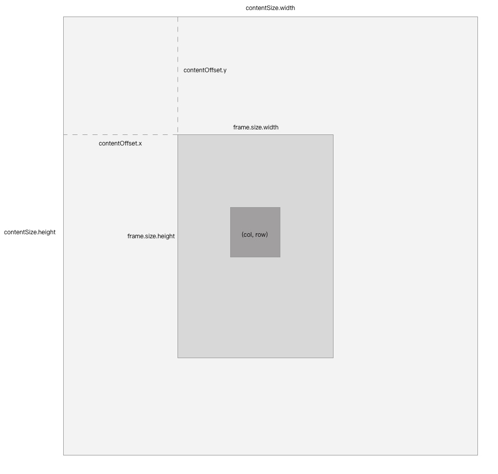

# 无限滚动scrollView

前不久看到这篇文章：https://itnext.io/creating-an-infinite-grid-on-ios-2bd6db28c581

是国外一个大佬解决的一个stackoverflow提问：怎么样创造一个可以无限滚动的scrollView。我根据这篇文章的主要思想在不使用约束的情况下作出自己的无限滚动scrollView，希望能给大家带来帮助。

在开始之前，首先向大家说明该项目的前提条件：

1. 该scrollView应当看起来是可以无限滚动的，即用户不会看到scrollView的碰撞边缘；
2. 该scrollView的内存占用应该尽量少，即不能靠绘制一个巨大的空间（例如1000000x1000000）来达到无限滚动的目的；
3. scrollView内的视图和数据应当通过tile，也就是瓦片来分批生成。

# 大神思路拆解
1. 通过使用约束撑大scrollView的ContentSize
2. 通过Key-Value Observing机制，监听scrollView的滚动
3. 在滚动的过程中动态地添加tile
4. 在滚动结束的节点（endDragging和endDecelerating）让scrollView的offset恢复到初始状态

大神的具体操作可以去看他对应的文章和github代码，这里就不详细解释了。

# 我的思路：
1. 我需要将整个scrollView通过UIViewRepresentable转换成SwiftUI的view，所以我不能使用storyboard和约束。通过分析可得，可以通过直接设置scrollView的contentSize来达到这一效果。
2. 我也不需要使用KVO机制来监听滚动，只需要通过UIScrollViewDelegate的scrollViewDidScroll方法来处理滚动事件即可。
3. 我需要以中心点为起点，向四周来渲染所需的tile。

结合代码来看一下：

## 构建基本代码
```swift
import SwiftUI

struct ContentView: View {
    var body: some View {
        InfiniteScrollView()
    }
}

struct InfiniteScrollView: UIViewRepresentable {

    func makeCoordinator() -> Coordinator {
        Coordinator()
    }

    func makeUIView(context: Context) -> UIScrollView {
        let scrollView = UIScrollView()
        context.coordinator.setupScrollView(scrollView: scrollView)
        return scrollView
    }

    func updateUIView(_ scrollView: UIScrollView, context: Context) {
        //
    }
    
    class Coordinator: NSObject, UIScrollViewDelegate {
        var scrollView: UIScrollView!
        let contentSize = CGSize(width: 100000, height: 100000)
        
        // 用于记录 scrollView 的相对偏移量
        var offset: CGPoint = .zero
    
        func setupScrollView(scrollView: UIScrollView) {
            self.scrollView = scrollView
            scrollView.delegate = self
            scrollView.scrollsToTop = false
            scrollView.showsVerticalScrollIndicator = false
            scrollView.showsHorizontalScrollIndicator = false
            resetOffset()
        }
        
        func resetOffset() {
            scrollView.contentSize = contentSize
            let offset = CGPoint(
                x: (scrollView.contentSize.width - scrollView.frame.size.width) / 2,
                y: (scrollView.contentSize.height - scrollView.frame.size.height) / 2
            )
            scrollView.setContentOffset(offset, animated: false)
            self.offset = .zero
        }
    }
}
```
通过这种方法，我们成功使用UIViewRepresentable创建了一个contentSize为100000x100000的scrollView。并且将scrollView的初始Offset设置为了中心。现在暂时还看不出什么，并且由于我关闭了滚动条显示，我们甚至不能感受到滚动的发生。但是别着急，我们即将开始渲染tile。

## tile绘制函数

接下来是绘制tile，与国外大神类似，我给每个tile设置了编号(x, y)，依次是它在列和行的排序，从(0,0)开始，向左上延伸为负，向右下延伸为正。每个编号标识一个独立的tile。

tile渲染代码如下(不特殊说明的情况下，以下所有的代码都在Coordinator内)：

``` swift
let tileSize = CGSize(width: 100, height: 100)
// 记录tiles
var tiles: [TileCoordinate:UILabel] = [:]

func createTile(coordinate: TileCoordinate) {
    // 计算tile的origin
    let origin = CGPoint(
        x: (scrollView.contentSize.width - tileSize.width) / 2 + offset.x + coordinate.x * tileSize.width,
        y: (scrollView.contentSize.height - tileSize.height) / 2 + offset.y + coordinate.y * tileSize.height
    )
    
    // 设置基本属性
    let tile = UILabel(frame: CGRect(origin: origin, size: tileSize))
    tile.text = "(\(coordinate.x.formatted()), \(coordinate.y.formatted()))"
    tile.textAlignment = .center
    let isCenter = coordinate.equalTo(.zero)
    tile.backgroundColor = UIColor.gray.withAlphaComponent(isCenter ? 1 : 0.5)
    tile.layer.borderWidth = 0.5
    tile.layer.borderColor = UIColor.black.withAlphaComponent(0.1).cgColor
    // 加入渲染
    scrollView.addSubview(tile)
    // 加入记录
    tiles.updateValue(tile, forKey: coordinate)
}
```
代码很简单，创建一个UILabel，并显示。接下来重点说一下tile的origin的计算：

origin是一个UIView的左上角坐标，但这个坐标是一个绝对坐标，而我们设计的scrollView只有相对坐标（每次拖拽结束后scrollView的contentOffset都会被设置回原来位置，而新增的偏移量则会记录在offset变量中，而offset表示的是一种相对概念，即相对原始位置偏移了多少），所以我们需要将相对坐标转换为绝对坐标。



算法如下：
由于我们设tile(0,0)为中心tile，所以在不考虑移动的情况下可以计算出来tile(0,0)的坐标为：

x: scrollView.contentSize.width / 2 - tileSize.width / 2
y: scrollView.contentSize.height / 2 - tileSize.height / 2

优化一下，使用结合律：

x: (scrollView.contentSize.width - tileSize.width) / 2
y: (scrollView.contentSize.height - tileSize.height) / 2

假设加上移动，则x，y各项需要再加上offset的x，y值，则坐标为：

x: (scrollView.contentSize.width - tileSize.width) / 2 + offset.x
y: (scrollView.contentSize.height - tileSize.height) / 2 + offset.y

接下来我们计算一下tile(1,1)的坐标，tile(1,1)的坐标应当在tile(0,0)的右下方，也就是tile(0,0)坐标向右下方偏移一个tileSize的距离，即：

x: (scrollView.contentSize.width - tileSize.width) / 2 + offset.x + tileSize.width
y: (scrollView.contentSize.height - tileSize.height) / 2 + offset.y + tileSize.height

由此可知tile(x,y)的坐标应当为：

x: (scrollView.contentSize.width - tileSize.width) / 2 + offset.x + x * tileSize.width
y: (scrollView.contentSize.height - tileSize.height) / 2 + offset.y + y * tileSize.height

接下来就让我们看看我们的tile坐标绘制是否正确吧，在UIViewRepresentable的updateView中增加以下代码，先绘制一个中心tile出来：

``` swift
func updateUIView(_ scrollView: UIScrollView, context: Context) {
    context.coordinator.createTile(coordinate: TileCoordinate(x: 0, y: 0))
}
```


我们发现为什么坐标有问题？这个方形的tile应当渲染在画面正中间才对。然而却渲染到了画面的左上角？原来这是因为在我们进行setupScrollView的时候，scrollView还没有渲染出来，此时scrollView的frame是 `.zero`, 所以我们设置的contentScroll并不在画面中心点，而是在ContentSize中心点。

好在iOS17在UIRepresentable协议中提供了sizeThatFits方法，可以让我们获取到建议尺寸。（关于swiftUI的尺寸关系网上有很多相关的文章，这里就不做科普了。）因为我们需要将scrollView撑满整个空间，所以给到建议尺寸后我们直接用该尺寸来设置scrollView的frame即可。

``` swift
// UIViewRepresentable

    func sizeThatFits(_ proposal: ProposedViewSize, uiView: UIScrollView, context: Context) -> CGSize? {
        guard let width = proposal.width, let height = proposal.height else { return nil }
        // 获取到建议尺寸
        let size = CGSize(width: width, height: height)
        // 设置frame
        uiView.frame.size = size
        // 重新初始化offset
        context.coordinator.resetOffset()
        return size
    }

```


这样一来，渲染就正确了。


## 代理事件
接下来就是处理滚动相关的事件了，关键有三个事件钩子：
scrollViewDidScroll、scrollViewDidEndDragging、scrollViewDidEndDecelerating。分别处理滚动中，拖拽结束，滚动结束三个动作。
我们先不管滚动中的处理，先来看看滚动结束的处理。滚动结束后，我们需要更新offset的值。至于为什么不在滚动中处理，等看完代码就知道了。

``` swift
var deltaOffset = CGPoint.zero
func scrollViewDidScroll(_ scrollView: UIScrollView) {
    deltaOffset = (scrollView.contentSize - scrollView.frame.size) * 0.5 - scrollView.contentOffset
}

var centerOffset: CGPoint {
    CGPoint(
        x: (scrollView.contentSize.width - scrollView.frame.size.width) / 2,
        y: (scrollView.contentSize.height - scrollView.frame.size.height) / 2
    )
}

func updateOffset() {
    if deltaOffset.equalTo(.zero) { return }
    offset = CGPoint(
        x: offset.x + deltaOffset.x,
        y: offset.y + deltaOffset.y
    )
    for tile in tiles {
        tile.value.frame.origin = CGPoint(
            x: tile.value.frame.origin.x + deltaOffset.x,
            y: tile.value.frame.origin.y + deltaOffset.y
        )
    }
    deltaOffset = .zero
    scrollView.setContentOffset(centerOffset, animated: false)
}

// 停止拖拽
func scrollViewDidEndDragging(_ scrollView: UIScrollView, willDecelerate decelerate: Bool) {
    if (!decelerate) {
        updateOffset()
    }
}

// 停止减速（scroll停止）
func scrollViewDidEndDecelerating(_ scrollView: UIScrollView) {
    updateOffset()
}
```
这里有两个关键点：
1. endDragging事件是在手脱离屏幕之后触发，当用户快速滚动scrollView的时候，由于setContentOffset的问题，在画面上会导致卡顿感。所以需要在endDragging事件中，仅当不会减速时(decelerate == false)才让dragging去updateOffset(也许我应该把contentSize再设大一点)
2. 当用户滚动scrollView之后再滚动scrollView并且停止手指动作时，会连续触发endDragging和endDecelerating事件，而由于setContentOffset是一个异步操作（不会立即执行），所以当两个事件同时执行的时候就会有冲突，解决方案是增加一个中间变量，它在updateOffset中会被初始化，并且阻止连续的updateOffset，这就是deltaOffset的用途。
3. 每次updateOffset之后，除了需要让scrollView复位，还需要更新每个tile的origin

回答一下之前的问题，为什么不在滚动中处理offset，因为offset是与contentOffset,tile.origin挂钩的数据，如果在滚动中修改offset，会导致一直在不停地操作scrollView和tile，既浪费性能，也会导致页面有卡顿感，因为setContentOffset这个函数在连续触发时有bug，它不能正确记录滚动的速度和减速度。

## 渲染tile
最后让我们来处理tile的渲染问题：
首先我们需要计算出需要渲染的tile的范围，然后逐个渲染每个tile，并且删除不在范围内的tile。
``` swift
// 计算需要渲染的tile
func populateTiles() {
    let frame = scrollView.frame.size
    let left = Int(round((-frame.width / 2 - offset.x - deltaOffset.x) / tileSize.width))
    let right = Int(round((frame.width / 2 - offset.x - deltaOffset.x) / tileSize.width))
    let top = Int(round((-frame.height / 2 - offset.y - deltaOffset.y) / tileSize.height))
    let bottom = Int(round((frame.height / 2 - offset.y - deltaOffset.y) / tileSize.height))
    renderTiles(rows: top...bottom, cols: left...right)
}

// 处理绘制
func renderTiles(rows: ClosedRange<Int>, cols: ClosedRange<Int>) {
    for row in rows {
        for col in cols {
            if !tiles.keys.contains(TileCoordinate(x: col, y: row)) {
                createTile(coordinate: TileCoordinate(x: col, y: row))
            }
        }
    }
    removeTiles(rows: rows, cols: cols)
}

// 删除不在范围内的tile
func removeTiles(rows: ClosedRange<Int>, cols: ClosedRange<Int>) {
    for coordinate in tiles.keys {
        if !rows.contains(Int(coordinate.y)) || !cols.contains(Int(coordinate.x)) {
            let tile = tiles[coordinate]
            tile?.removeFromSuperview()
            tiles.removeValue(forKey: coordinate)
            continue
        }
    }
}
```

看着代码是不是感觉很简单，实际上populateTiles我琢磨了三天，主要还是因为自己的空间想象力有所欠缺。

假设没有offset的情况下，由于中心tile的编号为(0,0)，所以左上角tile的编号应该是
x: Int(-frame.size.width / 2 / tileSize.width)
y: Int(-frame.size.height / 2 / tileSize.height)
这表示了左上角tile相对于tile(0,0)的偏移量，同理右下角tile的编号应该是：
x: Int(frame.size.width / 2 / tileSize.width)
y: Int(frame.size.heigth / 2 / tileSize.height)
因为绘制的范围从-frame.size / 2 ~ frame.size / 2（以中心分割），所以加上偏移量后应当为：

left: Int(round((-frame.width / 2 - offset.x - deltaOffset.x) / tileSize.width))
right: Int(round((frame.width / 2 - offset.x - deltaOffset.x) / tileSize.width))
top: Int(round((-frame.height / 2 - offset.y - deltaOffset.y) / tileSize.height))
bottom: Int(round((frame.height / 2 - offset.y - deltaOffset.y) / tileSize.height))

offset偏移量只在scrollView停止滚动后刷新，deltaOffset则记录了滚动时的偏移量。

最后是绘制范围内的tile，以及删除范围外的tile。

至此基本完成了无限滚动scrollView的开发，并且可以在运行资源占用中看到，我这个无限滚动scrollView拥有和大神一样的30mb低运行内存占用。

## scrollViewManager
最后我还给scrollView增加了一个scrollViewManager对象，用来将scrollView回到中心位置。
```swift
@Observable
final class InfiniteScrollViewManager {
    weak var coordinator: InfiniteScrollView.Coordinator!
    
    func backCenter() {
        guard let coordinator, let scrollView = coordinator.scrollView else { return }
        scrollView.setContentOffset((scrollView.contentSize - scrollView.frame.size) * 0.5 + (coordinator.offset + coordinator.deltaOffset), animated: true)
    }
}
```
代码相对简单，我就不展开了。